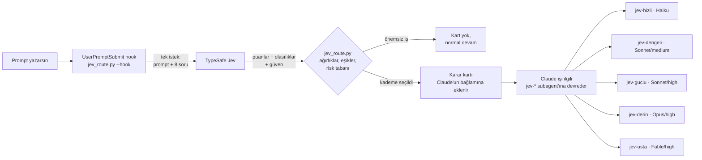

# 🎯 Jev — Karar Zekâsı

> **Kota tasarrufu, hız ve sonuç kalitesini işte bu karar zekâ halletti.**

Claude Code ve Cursor'da her görev için **hangi modelin** ve **hangi effort seviyesinin** kullanılacağına [TypeSafe](https://docs.typesafe.ai/introduction)'in **Jev** modeli karar verir.

Basit bir yazım hatası için Opus'u yakmazsın. Ödeme servisindeki bir race condition'ı da Haiku'ya emanet etmezsin. Jev her prompt'u okur, puanlar ve işi doğru kademeye yollar.

```
🎯 JEV KARARI
Kademe  : 🧠 Derin  →  jev-derin
Model   : opus   Effort: high
Puan    : 7.05/12  (kapsam 1.2 · belirsizlik 0.8 · risk 1.6 · akıl yürütme 1.1 · süre 1.0)
Maliyet : orta-yüksek
```

---

## İçindekiler

- [Jev nedir, ne değildir](#jev-nedir-ne-değildir)
- [Nasıl çalışır](#nasıl-çalışır)
- [Kademeler](#kademeler)
- [Karar algoritması](#karar-algoritması)
- [Kurulum](#kurulum)
- [Kullanım](#kullanım)
- [Yapılandırma](#yapılandırma)
- [Karar günlüğü ve ince ayar](#karar-günlüğü-ve-ince-ayar)
- [Gizlilik ve güvenlik](#gizlilik-ve-güvenlik)
- [Sınırlamalar](#sınırlamalar)
- [Sorun giderme](#sorun-giderme)
- [Dosya yapısı](#dosya-yapısı)
- [SSS](#sss)

---

## Jev nedir, ne değildir

**Jev**, TypeSafe'in "System One" modelidir. Metin üretmez, kod yazmaz, sohbet etmez. Bir *state* (burada: senin prompt'un) ve bir dizi tipli soru alır; olasılıkları ve güven değerleriyle birlikte yapılandırılmış cevaplar döner.

Bu yüzden Jev, Claude Code'un ya da Cursor'ın arkasındaki modelin **yerine geçmez**. Bu repo Jev'i bir **yönlendirici** olarak kullanır:

| Rol | Kim yapıyor |
|---|---|
| "Bu iş ne kadar zor, ne kadar riskli?" kararı | **Jev** (TypeSafe API) |
| Puanları birleştirip kademeyi seçmek | **`jev_route.py`** (senin kodun, eşikler senin elinde) |
| İşi fiilen yapmak | **Claude** (seçilen kademedeki subagent) |

---

## Nasıl çalışır



1. Claude Code'da bir prompt gönderdiğinde `UserPromptSubmit` hook'u tetiklenir.
2. `jev_route.py` prompt'u Jev'e gönderir. Sekiz soru tek istekte, paralel ve birbirinden bağımsız değerlendirilir.
3. Script cevapları ağırlıklarla birleştirir, kullanıcı tercihlerini ve güven değerlerini hesaba katar, risk tabanını uygular ve bir kademe seçer.
4. Karar kartı Claude'un bağlamına eklenir. Terminalde de tek satırlık bir özet görünür (`🎯 Jev: 🧠 Derin → jev-derin (opus, high)`).
5. Claude kartı gösterir ve işi eksiksiz bir brifle ilgili subagent'a devreder. Her subagent kendi `model` ve `effort` ayarıyla çalışır.

### Neden subagent'lar?

Bir hook ya da skill, çalışan oturumun modelini kendi başına değiştiremez. Ama Claude Code'da her subagent kendi `model` ve `effort` değerini frontmatter'ında taşıyabilir. Jev'in kararını **gerçekten uygulamanın** yolu, işi o ayarlarla tanımlanmış subagent'a devretmektir.

Bu yüzden ana oturum ucuz bir **santral** olarak çalışır (önerilen: `sonnet` + `low`), ağır işi yalnızca gerektiğinde pahalı kademe yapar.

---

## Kademeler

| Kademe | Subagent | Model | Effort | Tipik iş | Maliyet |
|---|---|---|---|---|---|
| ⚡ Hızlı | `jev-hizli` | Haiku | — | Arama, rename, format, commit mesajı, basit soru | düşük |
| ⚖️ Dengeli | `jev-dengeli` | Sonnet | `medium` | Rutin özellik, tek dosyalık bug, küçük refactor | düşük-orta |
| 💪 Güçlü | `jev-guclu` | Sonnet | `high` | Davranış değiştiren özellik, test gerektiren değişiklik | orta |
| 🧠 Derin | `jev-derin` | Opus | `high` | Çok dosyalı özellik, sinsi bug, güvenlik/veri hassas mantık | orta-yüksek |
| 🏛️ Usta | `jev-usta` | Fable | `high` | Mimari karar, sistem çapında kök neden, büyük migration | yüksek |

> Haiku effort seviyelerini desteklemediği için Hızlı kademede effort yoktur.

> **Usta kademesi onay ister.** Fable bazı planlarda plan limitleri yerine kullanım kredisinden düşebilir. Claude devretmeden önce senden onay alır; onay vermezsen iş `jev-derin`'e gider.

### Kademeler arası geçiş

- Bir subagent işi beklenenden zor bulursa `⬆️ YÜKSELT: <neden>` ile döner. Claude aynı brifi ve öğrenilenleri bir üst kademeye devreder.
- Dengeli ve Güçlü kademeler aynı sorunda iki deneme başarısız olursa zorlamayı bırakıp yükseltme ister.
- Zor kısım çözüldükten sonra kalan mekanik işler (import düzeltme, test çoğaltma, doküman) tekrar alt kademelere verilir.

---

## Karar algoritması

### 1. Jev'e sorulan sorular

TypeSafe'in önerisine uygun olarak tek bir büyük "hangi model?" sorusu yerine **atomik sorular** sorulur. Her soru tek bir şeyi, açık kriterlerle ölçer.

| Anahtar | Tür | Ölçtüğü şey | Seviyeler |
|---|---|---|---|
| `trivial` | Noul | Planlama gerektirmeyen küçük bir iş mi? | 0–1 |
| `scope` | Score | Kod tabanının ne kadarı değişecek? | tek dosya → birkaç dosya → çok modül |
| `ambiguity` | Score | Çözüm yolu ne kadar net? | net → yaklaşım seçilmeli → kök neden bilinmiyor |
| `risk` | Score | Hata ne kadar pahalıya patlar? | kozmetik → davranış değişir → güvenlik/ödeme/veri/migration |
| `reasoning` | Score | Ne kadar akıl yürütme gerekir? | mekanik → standart → algoritma/mimari/zor debug |
| `duration` | Score | İş ne kadar uzun? | tek adım → birkaç adım → çok aşamalı |
| `wants_speed` | Noul | Kullanıcı hız veya tasarruf istiyor mu? | 0–1 |
| `wants_quality` | Noul | Kullanıcı maksimum kalite istiyor mu? | 0–1 |

Prompt Jev'e `{"coding_task": "<prompt>"}` şeklinde gönderilir. Konuşma geçmişi veya kod gönderilmez, çünkü alakasız bağlam Jev'in doğruluğunu düşürür.

### 2. Puanlama (kodda)

Aritmetik Jev'de değil, kodda yapılır:

```
puan = kapsam×1.0 + belirsizlik×1.0 + risk×1.5 + akıl_yürütme×1.5 + süre×1.0     (0–12)
```

| Puan | Kademe |
|---|---|
| < 2.5 | ⚡ Hızlı |
| 2.5 – 4.5 | ⚖️ Dengeli |
| 4.5 – 6.5 | 💪 Güçlü |
| 6.5 – 9.0 | 🧠 Derin |
| ≥ 9.0 | 🏛️ Usta |

### 3. Düzeltmeler

Sırasıyla uygulanır:

1. **Önemsiz iş:** `trivial ≥ 0.8` ve `risk < 0.75` ise kart çıkmaz, prompt normal devam eder.
2. **Hız isteği:** `wants_speed ≥ 0.7` ise bir kademe aşağı.
3. **Kalite isteği veya belirsizlik:** `wants_quality ≥ 0.7` ise ya da Jev'in `risk` veya `reasoning` sorusundaki güveni `0.5`'in altındaysa bir kademe yukarı. İkisi birden olsa bile en fazla bir kademe.
4. **Risk tabanı:** `risk ≥ 1.5` ise en az 💪 Güçlü, `risk ≥ 0.75` ise en az ⚖️ Dengeli. "Hızlı yap" desen bile riskli bir iş Haiku'ya gitmez.

Üçüncü madde TypeSafe'in "confidence-gated routing" desenidir: cevap *ne* yapılacağını, güven ise *harekete geçilip geçilmeyeceğini* söyler. Jev emin değilse güvenli tarafa kayılır.

---

## Kurulum

### Gereksinimler

- Python 3.8+ (yalnızca standart kütüphane; `pip install` gerekmez)
- TypeSafe API anahtarı: <https://console.typesafe.ai/keys>
- Claude Code CLI (subagent frontmatter'ında `effort` desteği olan güncel bir sürüm) ve/veya Cursor

### 1. API anahtarı

Kabuk profiline (`~/.zshrc`, `~/.bashrc` vb.) ekle:

```bash
export TYPESAFE_API_KEY="ts_..."
```

Anahtarı **asla** repo'ya commit'leme. Script onu yalnızca ortam değişkeninden okur.

### 2. Dosyaları projeye ekle

```bash
cd proje-kokun
cp -r /path/to/jev/.jev .
cp -r /path/to/jev/.claude .     # Claude Code için
cp -r /path/to/jev/.cursor .     # Cursor için
echo "__pycache__/" >> .gitignore
```

Projede zaten bir `.claude/settings.json` varsa üzerine yazma; aşağıdaki `hooks` bloğunu mevcut dosyaya birleştir.

### 3. Bağlantıyı test et

```bash
python3 .jev/jev_route.py "Kullanıcı tablosuna soft delete ekle"
```

Bir karar kartı ve altında `/model`, `/effort` komutları görmelisin.

### 4a. Claude Code

`.claude/settings.json` içindeki hook:

```json
{
  "hooks": {
    "UserPromptSubmit": [
      {
        "hooks": [
          {
            "type": "command",
            "command": "python3 \"$CLAUDE_PROJECT_DIR\"/.jev/jev_route.py --hook",
            "timeout": 10
          }
        ]
      }
    ]
  }
}
```

Claude Code'u başlat ve ana oturumu santral olarak ayarla:

```
/model sonnet
/effort low
```

**Ekipte herkes kullanmayacaksa:** hook'u `.claude/settings.json` yerine `.claude/settings.local.json` dosyasına koy. Bu dosya git'e girmez; her geliştirici Jev'i isterse kendisi açar. Subagent ve skill dosyaları commit'lenebilir, hook olmadan kimseyi etkilemezler.

**Tüm projelerinde kullanmak istersen:** `.jev/` klasörünü `~/.jev-router/` gibi sabit bir yere koy ve hook'u `~/.claude/settings.json` içine o yolla ekle. Subagent'ları `~/.claude/agents/` altına kopyala.

### 4b. Cursor

`.cursor/rules/jev.mdc` her zaman aktif (`alwaysApply: true`) bir kuraldır. Cursor'da modeli bir kural değiştiremez, bu yüzden akış şöyledir:

1. Anlamlı bir görevin başında agent terminalde `python3 .jev/jev_route.py "<özet>"` çalıştırır.
2. Karar kartını gösterir.
3. Şu anki model kartla uyumluysa işe başlar. Daha güçlüyse tasarruf için geçebileceğini söyler ve devam eder. Daha zayıfsa ve iş Derin/Usta ise yalnızca plan çıkarır, modeli değiştirmeni bekler.

Model eşleştirmesi: `haiku` → hızlı/ucuz model veya Auto · `sonnet` → Sonnet · `opus` → Opus (thinking açık) · `fable` → en güçlü model, gerekirse Max Mode.

---

## Kullanım

### Claude Code'da

Hiçbir şey yapman gerekmez. Normal şekilde prompt yaz:

```
> Checkout sayfasındaki indirim kodu bazen iki kez uygulanıyor, bul ve düzelt.
```

Terminalde `🎯 Jev: 🧠 Derin → jev-derin (opus, high)` satırını görürsün. Claude kartı gösterir ve işi `jev-derin`'e devreder.

Tercihini prompt'ta belirtebilirsin, Jev bunu da okur:

```
> Hızlıca şu endpoint'e rate limit ekle, kota bitiyor.       → bir kademe aşağı
> Bu migration production'a gidecek, emin olmamız lazım.       → bir kademe yukarı
```

Açıkça model istersen o geçerli olur:

```
> Bunu Opus'la yap: ...
```

Jev'e **gönderilmeyen** prompt'lar:

- `/` ile başlayan slash komutları (`/model`, `/effort`, `/compact` ...)
- `JEV_DISABLED=1` ile başlatılmış oturumlar

### Elle karar almak

```bash
# Karar kartı + /model ve /effort komutları
python3 .jev/jev_route.py "Auth middleware'ini JWT'den session'a taşı"

# Jev'in ham cevabı ve hesaplanan karar (JSON)
python3 .jev/jev_route.py --json "Auth middleware'ini JWT'den session'a taşı"

# stdin'den
echo "README'deki yazım hatalarını düzelt" | python3 .jev/jev_route.py
```

Claude Code içinde "kararı Jev versin" ya da "Jev sadece önersin" demek de `jev` skill'ini tetikler.

---

## Yapılandırma

### Ortam değişkenleri

| Değişken | Varsayılan | Açıklama |
|---|---|---|
| `TYPESAFE_API_KEY` | — | **Zorunlu.** TypeSafe API anahtarı. |
| `JEV_MODEL` | `jev-latest` | Kullanılacak Jev sürümü. Davranışı sabitlemek için belirli bir sürüm yaz. |
| `JEV_TIMEOUT` | `6` | Jev isteği için saniye cinsinden zaman aşımı. |
| `JEV_DISABLED` | — | `1` ise hook hiçbir şey yapmaz. |
| `JEV_LOG` | `~/.jev/decisions.jsonl` | Karar günlüğünün yolu. |

Hook'un kendi zaman aşımı `settings.json` içinde 10 saniyedir. Jev `429` veya `529` dönerse script kısa bir beklemeyle bir kez daha dener.

### Eşikler ve ağırlıklar

Hepsi `.jev/jev_route.py` dosyasının başındadır:

```python
WEIGHTS = {"scope": 1.0, "ambiguity": 1.0, "risk": 1.5, "reasoning": 1.5, "duration": 1.0}
TIER_CUTS = [2.5, 4.5, 6.5, 9.0]
TRIVIAL_AT = 0.8
PREF_AT = 0.7
UNSURE_AT = 0.5
RISK_FLOORS = [(1.5, 2), (0.75, 1)]
```

Örnekler:

- Opus'a daha az gitmek istiyorsan `TIER_CUTS[2]` değerini (6.5) yükselt.
- Güvenlik ağırlıklı bir projedeysen `WEIGHTS["risk"]` değerini artır.
- Fable'ı hiç kullanmak istemiyorsan `TIER_CUTS[3]` değerini `99` yap.

### Kademeleri değiştirmek

`TIERS` listesi her kademenin subagent'ını, modelini ve effort'unu tanımlar. Bir kademeyi değiştirirsen `.claude/agents/` altındaki ilgili dosyanın frontmatter'ını da aynı şekilde güncelle; asıl uygulanan ayar oradadır.

```yaml
---
name: jev-derin
model: opus
effort: high
---
```

---

## Karar günlüğü ve ince ayar

Her karar `~/.jev/decisions.jsonl` dosyasına bir satır olarak yazılır:

```json
{"ts": "2026-09-25T14:02:11", "task": "Checkout sayfasındaki indirim kodu...", "tier": "derin", "points": 7.05, "scores": {"scope": 1.2, "ambiguity": 0.8, "risk": 1.6, "reasoning": 1.1, "duration": 1.0}, "notes": []}
```

Önerilen döngü:

1. Varsayılan eşiklerle bir hafta çalış.
2. Günlüğe bak: hangi işler gereksiz yere yukarı, hangileri yetersiz kademeye gitti?
3. `TIER_CUTS` ve `WEIGHTS` değerlerini buna göre ayarla.

Kademe dağılımını görmek için:

```bash
python3 -c "import json,collections,os; print(collections.Counter(json.loads(l)['tier'] for l in open(os.path.expanduser('~/.jev/decisions.jsonl'))))"
```

> Günlük yerel diskte tutulur ve prompt'ların ilk 300 karakterini içerir. İstemiyorsan `JEV_LOG=/dev/null` ayarla.

---

## Gizlilik ve güvenlik

- **Dışarı giden veri:** Hook açıkken her prompt'un metni TypeSafe API'sine gönderilir. Konuşma geçmişi, dosya içeriği veya kod gönderilmez. Şirket projelerinde bunun veri politikanıza uygun olduğunu kontrol et.
- **API anahtarı:** Yalnızca ortam değişkeninden okunur, hiçbir dosyaya yazılmaz.
- **Commit:** `.jev/`, `.claude/agents/`, `.claude/skills/` ve `.cursor/rules/` güvenle commit'lenebilir. Hook'u commit'lemek (`.claude/settings.json`) repo'yu açan herkesin prompt'larının Jev'e gitmesi demektir; ekipçe karar verin.
- **Yanlış yönlendirme:** Prompt metni Jev'e veri olarak gider. Jev'in dokümanında da belirtildiği gibi, kasıtlı olarak yanıltıcı bir metin kararı etkileyebilir. En kötü durumda iş gereğinden ucuz veya pahalı bir kademeye gider; risk tabanı en tehlikeli durumu sınırlar.

---

## Sınırlamalar

- **Jev modeli değiştirmez, önerir ve yönlendirir.** Claude Code'da karar subagent'lar üzerinden uygulanır; Cursor'da modeli sen seçersin.
- **Her prompt'a bir API çağrısı eklenir.** Jev hızlı bir model olsa da her mesajda küçük bir gecikme olur.
- **Subagent bağlamı ayrıdır.** Devredilen subagent konuşmanın önceki kısmını görmez; kalite, Claude'un yazdığı brifin kalitesine bağlıdır.
- **Türkçe prompt'lar.** Sorular İngilizce, prompt metni olduğu gibi gönderilir. Kendi iş tiplerinde `--json` ile birkaç örnek deneyip puanların mantıklı olduğunu doğrula.
- **VS Code eklentisi.** VS Code eklentisinde `UserPromptSubmit` hook bağlamının modele ulaşmadığına dair açık bir hata kaydı var. En güvenilir çalışma ortamı Claude Code CLI.
- **Model takma adları.** `opus`, `sonnet`, `haiku`, `fable` takma adları zamanla daha yeni sürümlere işaret eder ve sağlayıcıya göre farklı modellere çözülebilir. Belirli bir sürüm istiyorsan subagent dosyasına tam model adını yaz.

---

## Sorun giderme

| Belirti | Olası neden | Çözüm |
|---|---|---|
| Her mesajda `Jev'e ulaşılamadı (TYPESAFE_API_KEY tanımlı değil)` | Anahtar, Claude Code'un başlatıldığı kabukta yok | `export TYPESAFE_API_KEY=...` ekle, terminali yeniden aç |
| `HTTP Error 401` | Geçersiz anahtar | Konsoldan yeni anahtar oluştur |
| `HTTP Error 422` | İstek gövdesi geçersiz (genelde script düzenlenirken bozulmuş) | `--json` ile elle çalıştırıp hatayı gör |
| `timed out` | Ağ yavaş ya da Jev yoğun | `JEV_TIMEOUT` değerini artır; hook `timeout` değerini de ona göre yükselt |
| Kart görünüyor ama Claude devretmiyor | Subagent dosyaları yüklenmemiş | `/agents` ile `jev-*` subagent'larının listelendiğini kontrol et |
| Terminalde hiçbir Jev satırı yok | Hook çalışmıyor ya da iş önemsiz sayıldı | `claude --debug` ile hook çıktısına bak; elle `--json` çalıştırıp `trivial` değerine bak |
| Subagent yanlış modelde çalışıyor | Organizasyon izin listesi (`availableModels`) modeli engelliyor | Yöneticinle konuş ya da subagent'ı izin verilen bir modele çevir |

Hook'u elle simüle etmek için:

```bash
echo '{"prompt":"Ödeme servisindeki race condition'"'"'ı düzelt"}' | python3 .jev/jev_route.py --hook
```

---

## Dosya yapısı

```
.
├── .jev/
│   └── jev_route.py          # Jev'e soran ve kademeyi seçen yönlendirici (hook + CLI)
├── .claude/
│   ├── settings.json         # UserPromptSubmit hook'u
│   ├── skills/
│   │   └── jev/SKILL.md      # Kararın nasıl uygulanacağı; elle çağırma
│   └── agents/
│       ├── jev-hizli.md      # ⚡ Haiku
│       ├── jev-dengeli.md    # ⚖️ Sonnet / medium
│       ├── jev-guclu.md      # 💪 Sonnet / high
│       ├── jev-derin.md      # 🧠 Opus / high
│       └── jev-usta.md       # 🏛️ Fable / high
├── .cursor/
│   └── rules/jev.mdc         # Cursor kuralı
└── README.md
```

---

## SSS

**Jev'i Claude Code'un modeli olarak seçebilir miyim?**
Hayır. Jev metin üretmez ve araç çağırmaz. Kodlama ajanını çalıştıran model Claude olarak kalır; Jev sadece hangi Claude modelinin çalışacağına karar verir.

**Neden kararı Claude'un kendisi vermiyor?**
Verebilir, ama o durumda karar da kotadan yer ve her seferinde metin olarak üretilip yorumlanır. Jev tipli cevap, olasılık ve güven döner; eşikler kodda sabittir, yani aynı prompt her zaman aynı mantıkla yönlendirilir ve kararı günlükten denetleyebilirsin.

**Ana oturumu neden Sonnet/low yapıyoruz?**
Ana oturum yalnızca kartı gösterip brif yazıyor. Asıl iş subagent'ta, kendi model ve effort ayarıyla yapılıyor. Ana oturumu pahalı bir modelde tutmak, sadece dağıtım işi için kota harcamak demek.

**Jev yanlış karar verirse?**
Prompt'ta modeli açıkça belirt ("bunu Opus'la yap"), o geçerli olur. Kalıcı bir sapma görüyorsan günlüğe bakıp eşikleri ayarla.

**Jev'e erişilemezse oturum bozulur mu?**
Hayır. Script hata durumunda sessizce çekilir (fail-open); tek satırlık bir uyarı görürsün ve prompt yönlendirilmeden normal şekilde işlenir.

**Codex ya da başka ajanlarla çalışır mı?**
`jev_route.py` ajan bağımsızdır; herhangi bir ortamdan komut satırıyla çağrılabilir. Hook ve subagent entegrasyonu ise Claude Code'a özgüdür.

---

## Kaynaklar

- [TypeSafe dokümantasyonu](https://docs.typesafe.ai/introduction)
- [Jev ile kodlama ajanları](https://docs.typesafe.ai/introduction/coding-agents)
- [TypeSafe API referansı](https://docs.typesafe.ai/api)
- [Confidence-gated routing deseni](https://docs.typesafe.ai/patterns/confidence-routing)
- [Claude Code model ve effort yapılandırması](https://code.claude.com/docs/en/model-config)
- [Claude Code hooks referansı](https://code.claude.com/docs/en/hooks)
- [Claude Code subagent'lar](https://code.claude.com/docs/en/sub-agents)
